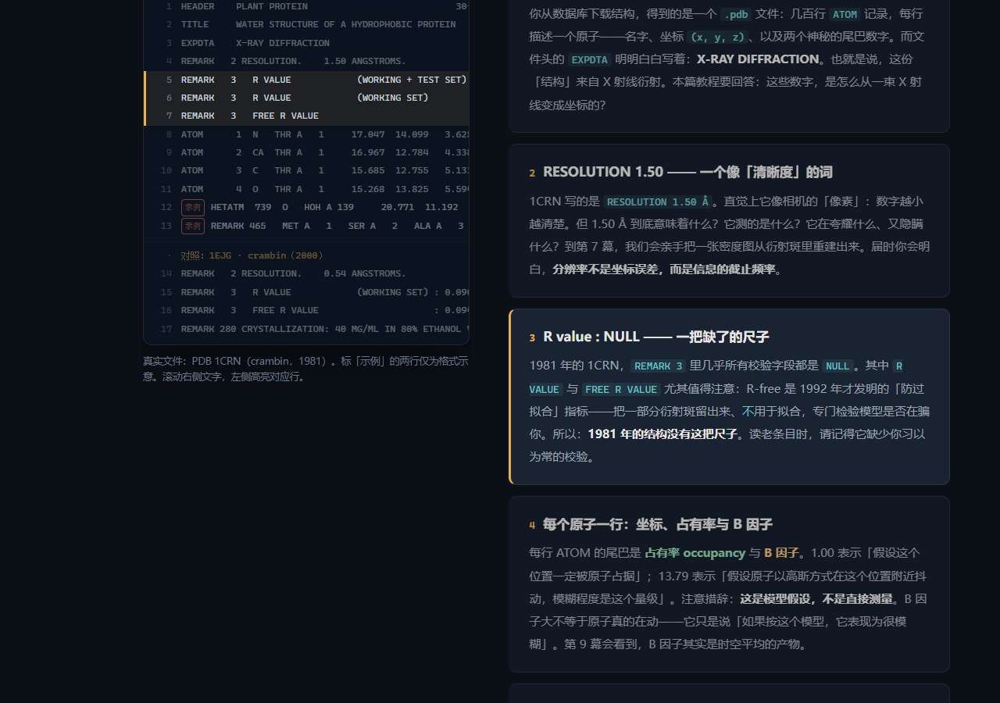

# 看不见的原子 —— 从一束 X 射线到 PDB 里的一行坐标

用交互式可视化，从零构建 X 射线单晶衍射的原理，并层层揭开 PDB 结构数据中那些**容易被忽略的隐患与缺陷**。

面向生信学习者。目标不是灌输术语，而是让你亲手「造」出那条链：
**波长 → 晶体 → 衍射斑 → 相位 → 密度图 → 原子模型 → 隐患**。


## 读者使用指南（零配置）

**直接打开下面的网址就能读，不需要安装任何东西：**

> **https://justplayinger.github.io/XRD_Guide/**

阅读方式：

1. 从上往下滚动 —— 右侧是文字「旁白」，左侧图形会跟着阅读自动前进一步；
2. 遇到 **滑块** 就拖一拖、遇到 **按钮** 就点一点 —— 动手才算看懂；
3. 按键盘 `←` `→` 可在步骤间前后跳转；顶部导航可随时跳回任何一幕；
4. 每一幕末尾有「上一幕 / 下一幕」按钮，不会迷路。

（以下「本地运行」仅对想要修改/开发本项目的人有用。）

## 这个项目在做什么

你在数据库中下载到的每个 `.pdb` 文件，都声称「由 X 射线衍射测定」。
分辨率、R-free、B 因子、占有率、缺失残基…… 这些数字你每天都在读，但它们到底意味着什么？

本项目把整条测定流程**从头构建一遍**，遵守三条设计契约：

1. **概念守恒律** —— 每一幕只使用「读者已知的概念」或「前文亲手建立的概念」，术语永远从现象中长出来，而不是从天上掉下来。
2. **先现象，后命名** —— 先看到、再归纳、最后才给学名；而每个学名都对应到 PDB 文件里的某个字段。
3. **诚实标注律** —— 每张图都标注「做了哪些简化」。因为认识模型的局限，正是这个项目要训练的直觉。

## 章节地图

| 幕 | 标题 | 内容 | 状态 |
|---|---|---|---|
| ACT 0 | [案发现场：一个 PDB 条目里的可疑数字](https://rcsb.org/structure/1CRN) | 真实条目里那些「看着像事实」的数字 | ✅ |
| ACT 1 | 看见需要波：波长决定可分辨的尺度 | 为什么必须用 X 射线（交互式波动实验） | ✅ |
| ACT 2 | 透镜的缺席 | X 射线无法聚焦 → 成像必须靠计算 | 🚧 M2 |
| ACT 3 | 斑点从哪来 | 两个散射体 → 干涉 → d·sinθ | 🚧 M2 |
| ACT 4 | 为什么非要晶体 | 周期性 → 离散强斑；布拉格条件；倒易点阵；Ewald 球 | 🚧 M2 |
| ACT 5 | 格子 × 内容 | 晶格定位置、内容定强度；相量求和 → 结构因子 | 🚧 M3 |
| ACT 6 | 相位问题 | 探测器只记录 \|F\|²，相位丢失；三种解法 | 🚧 M3 |
| ACT 7 | 分辨率 | 把斑点加回成密度图；**分辨率 = 信息截止频率** | 🚧 M3 |
| ACT 8 | 从密度到坐标 | 多解性、R-work / R-free（过拟合）、模型偏倚 | 🚧 M4 |
| ACT 9 | 晶体不是细胞 | 时空平均、堆积、冷冻、辐射损伤、配体过度解释 | 🚧 M4 |
| ACT 10 | 使用者的检查清单 | 读结构前该看什么；偏差如何传播进生信管线 | 🚧 M5 |




## 本地运行（仅开发者）

> 只是想**读**教程？直接访问 [https://justplayinger.github.io/XRD_Guide/](https://justplayinger.github.io/XRD_Guide/) 即可，无需任何安装。
> 以下命令只适合想要修改/扩展本项目的人，需要 Node.js ≥ 22。

```bash
npm install
npm run dev        # 开发服务器（Vite）
npm run build      # 类型检查 + 生产构建到 dist/
npm run preview    # 预览生产产物
```

测试与校验：

```bash
npm run check      # 数值内核校验：Fresnel 积分、波动场物理行为
npm run smoke      # 无头浏览器端到端冒烟测试（需先 npx playwright install chromium）
npm run shots      # 重新生成截图（输出到 C:/temp/xrd-shots/）
```

## 技术栈与结构

Vite 8 + TypeScript 5.9，零 UI 框架，**零 CDN 依赖**（全部打包，可离线运行）。

自写计算内核（每份代码都是可阅读的学习资料）：

- `src/lib/fresnel.ts` —— Fresnel 积分（近场衍射的解析内核）
- `src/lib/wave.ts` —— 波动场渲染器（Babinet 原理，Canvas 2D + HiDPI）
- `src/lib/scrolly.ts` —— 滚动叙事引擎
- `scripts/check-*.mts` —— 与独立数值积分 / 标准值对照的校验脚本

```
src/
├─ main.ts                    # 应用入口（导航 / Hero / 章节装配 / 进度条）
├─ styles/index.css           # 暗色学术风设计系统
├─ lib/                       # 自写计算与交互内核
└─ chapters/
   ├─ act00_entry/            # ACT 0 案发现场（真实 PDB 文件卡片）
   └─ act01_wavelength/       # ACT 1 波动实验（交互式衍射场）
public/data/                  # 真实 PDB 条目：1CRN、1EJG
docs/notes/                   # 物理注解与数据来源
```

## 数据来源

内置的 PDB 文件取自 [RCSB PDB](https://www.rcsb.org/)（公开数据，无版权主张），
详见 [docs/notes/data-sources.md](docs/notes/data-sources.md)。

## 许可

- 代码：MIT License（见 [LICENSE](LICENSE)）
- 文字与可视化内容：CC BY 4.0（见 [LICENSE-CONTENT](LICENSE-CONTENT)）
- 内置 PDB 数据版权归原发布者所有

## 发布到 GitHub Pages

1. 在本地初始化并推送到你的仓库：

   ```bash
   git init
   git add .
   git commit -m "feat: Act 0-1 完成"
   git branch -M main
   git remote add origin https://github.com/<你的用户名>/XRD_Guide.git
   git push -u origin main
   ```

2. 在仓库 **Settings → Pages → Build and deployment → Source** 选择 **GitHub Actions**。

3. 之后每次 push 到 `main` 都会自动构建并部署（见 [.github/workflows/deploy.yml](.github/workflows/deploy.yml)）。

> 站点使用相对路径 `base: './'`，仓库名不影响部署，也可部署到自定义域名。
